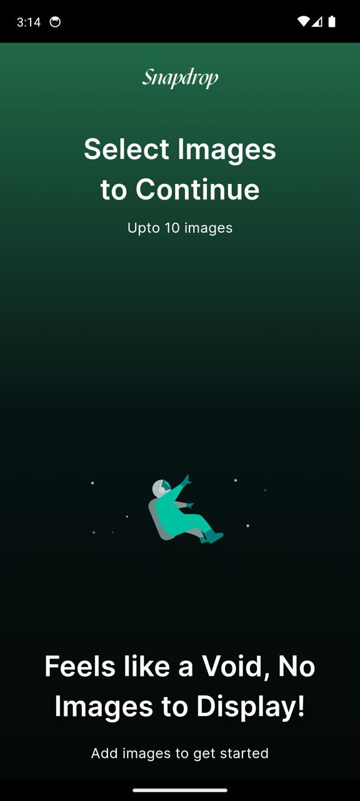
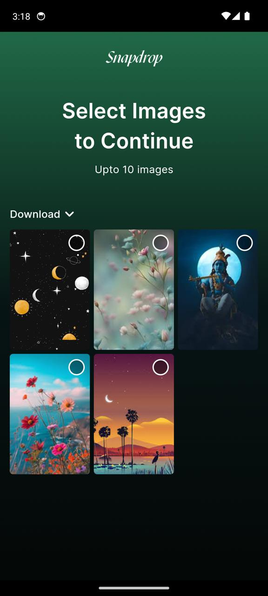
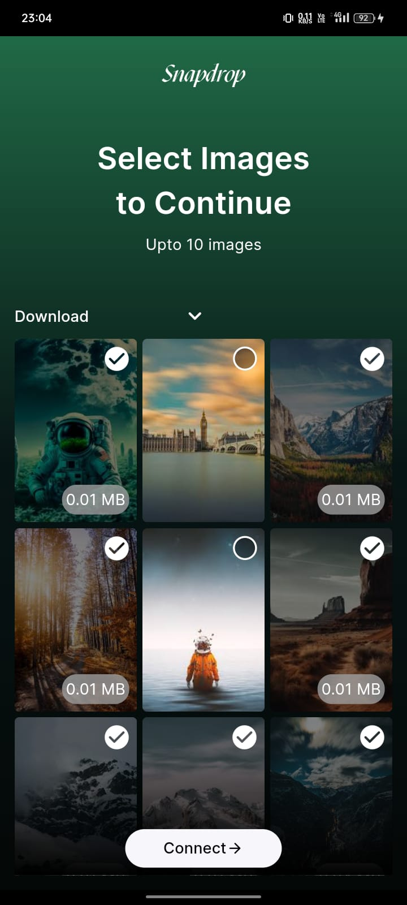
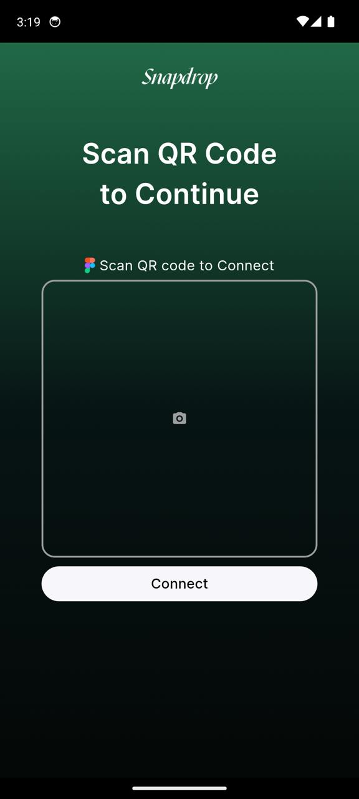
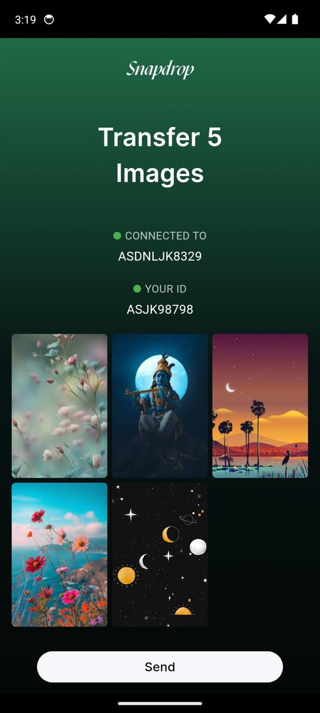

<a>
 
<h1> Snapdrop </h1>

## Snapdrop - Effortless Image Transfer for UI/UX Designers

### 1. Features:

* Direct phone to Figma image transfer
* Secure QR code connection
* Seamless Figma plugin integration
* Review & integrate images in Figma

### 2. Useful For:

* UI/UX designers
* Anyone transferring images between phone and Figma

### 3. Core Structure:

* Mobile app: image selection & QR Scanning
* Figma plugin: QR code Generation & image import

### 4. Resources & Inspirations:

* Solves common designer image transfer pain point
* Streamlines workflow & improves design efficiency

### 5. Future Scope:

* Send Up to 10 Images at Once: Effortlessly transfer multiple images in a single go.
* Support for Larger Files (Over 5MB): Handle high-resolution images without limitations.
* Transfer History: View and manage your past image transfers for easy reference.
* Multi-Lingual Support: Use Snapdrop in your preferred language for a global design experience.
* Theme Customization: Personalize your Snapdrop experience with custom colors and light/dark themes.

### 6. Screenshots:
<table>
  <tr>
    <td>
      
    </td>
        <td>
      
    </td>
        <td>
      
    </td>
  </tr>
   <tr>
    <td>
      
    </td>
    <td>
      
    </td>
      <td>
      
    </td>
  </tr>
     <tr>
  </tr>
</table>


### 6. File Structure

A High-level overview of the project structure:
```

lib/                     # Root Package
|
├─ Constant/                             # Constant files to use across the app
│  ├─ global_showcase_key/               # global key used for showcase view
│  ├─ theme_constant/                    # theme file
│
├─ Screen/                               # Contain all the main screens of the app
│  ├─ home_screen/                       # home screen for the app
│  ├─ intent_sharing_screen/             # Images send directly from other app
│  ├─ onboard_screen/                    # Onboarding user for the first time
│  ├─ qr_screen/                         # QR Screen
│  ├─ send_file_screen/                  # Review selected images screen
|
├─ Services/                             # Services used for the app
│  ├─ check_internet_connectivity/       # to check internet connectivity before sending the images
│  ├─ file_image/                        # used to identify the size of the image
│  ├─ first_time_login/                  # check first time login to display showcase view and onboarding screen
│  ├─ media_provider/                    # this class provides app with the album list and the images that are present in the album
│  ├─ permission_provider/               # To ask user to grant permission for storage and camera for picking images and scanning qr code
│  ├─ socket_service/                    # To transfer all the images from phone to your figma design file
|
├─ Widgets/                              # Widgets used multiple times throught the application is present here
│  ├─ app_bar_widget/                    # app bar for the app
│  ├─ connect/                           # connect to connecting to socket and sending images from phone to figma
│  ├─ dropdown_view/                     # dropdown used to display all the albums present with in the application and the images in a gridview
│  ├─ figma_display_helper/              # for displaing figma info
│  ├─ hero_text/                         # To display info throughtout every screen
│  ├─ intent_file_diplayer/              # Display images which is shared from other apps to Snapdrop
│  ├─ intro_widget/                      # used in the intro screen to display info
│  ├─ qr_scanner/                        # actual qr scanning code
│  ├─ room_displayer/                    # to display the room id when connected to figma
│  ├─ selected_images/                   # review images displayer
|
├─ main/                # Main class

```

# 7. Libraries

- [photo_manager](https://pub.dev/packages/photo_manager)
- [flutter_svg](https://pub.dev/packages/flutter_svg)
- [qr_code_scanner](https://pub.dev/packages/qr_code_scanner)
- [socket_io_client](https://pub.dev/packages/socket_io_client)
- [flutter_launcher_icons](https://pub.dev/packages/flutter_launcher_icons)
- [receive_sharing_intent](https://pub.dev/packages/receive_sharing_intent)
- [photo_manager_image_provider](https://pub.dev/packages/photo_manager_image_provider)
- [permission_handler](https://pub.dev/packages/permission_handler)
- [lottie](https://pub.dev/packages/lottie)
- [device_info_plus](https://pub.dev/packages/device_info_plus)
- [showcaseview](https://pub.dev/packages/showcaseview)
- [shared_preferences](https://pub.dev/packages/shared_preferences)
- [introduction_screen](https://pub.dev/packages/introduction_screen)
- [shimmer](https://pub.dev/packages/shimmer)

</a>

